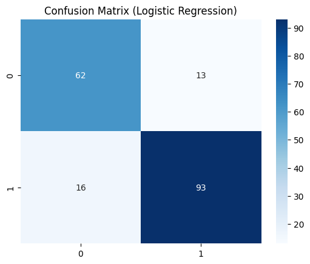
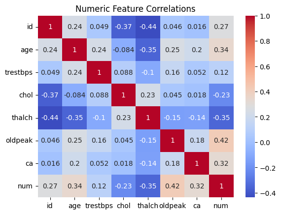
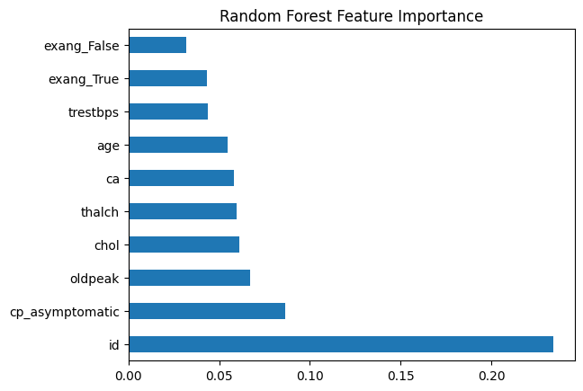
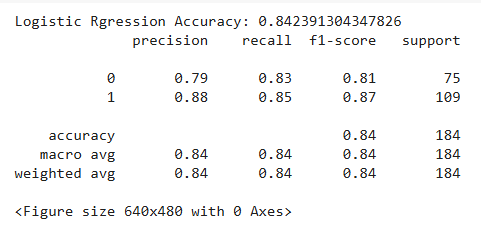
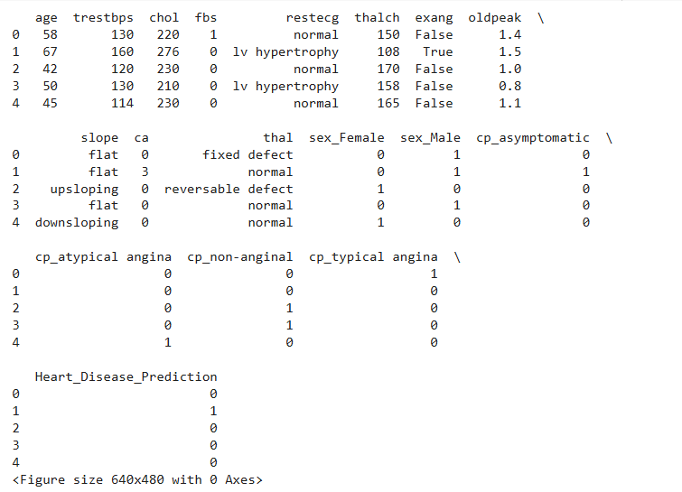

# 🩺 Disease Prediction Toolkit  

## 📌 Project Overview  
The **Disease Prediction Toolkit** is an AI/ML project designed to predict diseases using real-world healthcare datasets. By applying machine learning models such as **Logistic Regression**, **Decision Tree**, and **Random Forest**, this toolkit empowers beginners to analyze health data, build predictive models, and showcase results in a professional portfolio.  

---

## 🎯 Objectives  
- Learn **data preprocessing** techniques for healthcare datasets.  
- Build, train, and optimize **ML models** for disease prediction.  
- Evaluate models using performance metrics and visualizations.  
- Document results in a **GitHub portfolio** for healthcare AI/ML roles.  

---

## ⚙️ Tech Stack  
- **Languages:** Python  
- **Libraries/Frameworks:** scikit-learn, pandas, numpy, matplotlib, seaborn  
- **Datasets:** Kaggle healthcare datasets (e.g., Heart Disease UCI, Diabetes)  
- **Tools:** Google Colab / Replit  

---

## 🚀 Features  
- Preprocessing pipeline: handle missing values, categorical encoding, scaling.  
- Multiple ML models: Logistic Regression, Decision Tree, Random Forest.  
- Model evaluation with **accuracy, precision, recall, F1-score, ROC-AUC**.  
- Visualizations: Confusion Matrix, ROC Curve, Feature Importance.  
- Beginner-friendly, modular code for learning and extension.  

---

## 📖 How to Run  
1. Clone the repository:  
   ```bash
   git clone https://github.com/shania67/Medical_Disease_Prediction.git
   cd Medical_Disease_Prediction
   ```
2. Open the project in **Google Colab** or **Replit**.  
3. Install dependencies:  
   ```bash
   pip install -r requirements.txt
   ```
4. Run preprocessing and training scripts.  
5. Visualize results and evaluate model performance.  

---

## 📊 Evaluation Metrics  
- Accuracy  
- Precision  
- Recall  
- F1-score  
- ROC-AUC  

---

## 📊 Results

### Confusion Matrix


### Feature Correlation


### Feature Importance


### Logistic Regression


### Heart Disease Prediction


---

## 💡 Tips for Success  
- Use **Google Colab** for free GPU access and easier setup.  
- Refer to **scikit-learn & Kaggle tutorials** for troubleshooting.  
- Collaborate with peers via Discord or GitHub discussions.  
- Keep documentation **clear and professional** with code + visualizations.  

